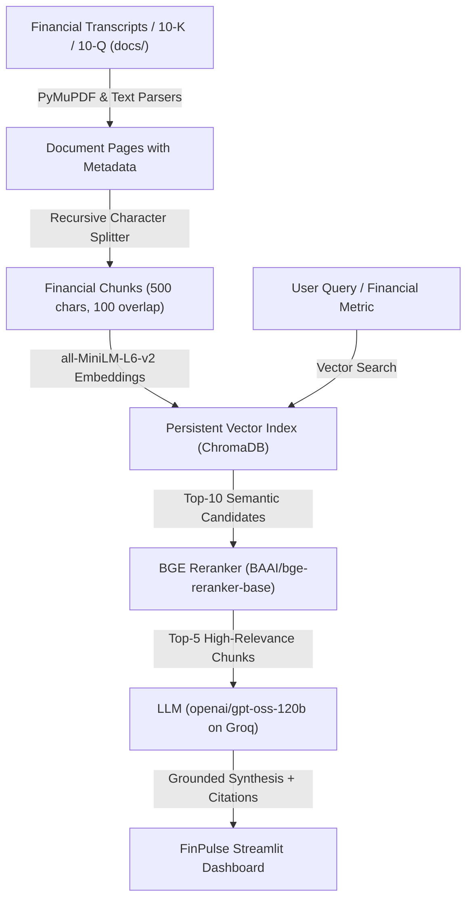

# 📈 FinPulse: AI Financial & Earnings Call Research Copilot

A production-grade, institutional-quality RAG (Retrieval-Augmented Generation) copilot for quarterly earnings call transcripts, SEC 10-K/10-Q reports, and cross-company financial benchmarking.

Designed with rigorous citation extraction, numerical grounding, hallucination prevention, and cross-company guidance inconsistency detection.

---

## 🌟 Key Features

1. **🔍 Financial Q&A Copilot (Text-Only)**:
   - Fast, text-based financial research query execution.
   - Built-in high-impact prompt chips for instant benchmarking (e.g., Blackwell GPU margins, Azure vs. Google Cloud operating profit, Tesla Robotaxi CapEx).
   - Strict citation grounding linking every claim directly to exact corporate filings and chunk references.
   - Colored confidence badges (High / Medium / Low) with Human Analyst Review logging.

2. **⚖️ Cross-Company Guidance & Peer Inconsistency Detection**:
   - Compare guidance, CapEx roadmaps, or market outlooks between any two corporate filings (e.g., NVIDIA vs. Microsoft on AI Infrastructure CapEx, Tesla vs. Alphabet on Autonomous Mobility).
   - Analyzes conflicting claims, divergent forecasts, and strategic misalignments with structured reasoning.

3. **📁 Financial Filings & Transcripts Library**:
   - Review all indexed quarterly reports and call transcripts with size statistics.
   - Drag-and-drop uploader to index new PDF, TXT, or Markdown filings live into the vector database.

4. **⚡ Dedicated Workspace Navigation (No UI Stacking)**:
   - Sidebar-driven view isolation ensures each feature has its own dedicated workspace without clutter or overlapping UI elements.

---

## 🚀 How to Run Locally

### 1. Prerequisites
- Python 3.10 or higher.
- A free Groq API Key ([console.groq.com/keys](https://console.groq.com/keys)).

### 2. Setup Virtual Environment
```powershell
python -m venv venv
.\venv\Scripts\Activate.ps1
pip install -r requirements.txt
```

### 3. Environment Configuration
Create or edit `.env` in the project root:
```env
GROQ_API_KEY=gsk_your_groq_api_key_here
```

### 4. Index Financial Documents
Parse, chunk, and embed the financial transcripts into the ChromaDB vector store:
```powershell
python ingest.py --clear
```

### 5. Start the FinPulse UI
```powershell
streamlit run app.py
```
Open [http://localhost:8501](http://localhost:8501) in your browser.

---

## ☁️ Streamlit Cloud Deployment (Simple 3-Step Guide)

1. **Commit & Push to GitHub**:
   ```powershell
   git add .
   git commit -m "FinPulse Financial & Earnings Call Copilot ready for deployment"
   git push origin main
   ```

2. **Deploy on Streamlit Community Cloud**:
   - Navigate to [share.streamlit.io](https://share.streamlit.io/) and click **"New app"**.
   - Select your repository, branch (`main`), and set main file to `app.py`.

3. **Configure Cloud Secrets**:
   - In **Advanced Settings > Secrets**, enter:
     ```toml
     GROQ_API_KEY = "gsk_your_groq_api_key_here"
     ```
   - Click **Deploy**!

> **Initial Cloud Setup**: On first deployment, click the **"🚀 Initialize Financial Database"** button on the dashboard to build the vector index instantly.

---

## 🏗️ Architecture & Pipeline



---

## 📁 Repository Structure

```
├── app.py                     # Streamlit FinPulse UI (Sidebar navigation, Q&A, Peer Comparison)
├── config.py                  # Tunable parameters, model configs, and secrets loader
├── ingest.py                  # Document parser, chunker, and vector store loader
├── rag_engine.py              # Retrieval, cross-encoder reranking, and citation synthesis
├── vector_store.py            # ChromaDB interface (embeddings, collections, similarity search)
├── llm_client.py              # LLM client with retry logic, confidence scoring & citations
├── reranker.py                # BGE cross-encoder reranker
├── requirements.txt           # Minimal, cloud-compatible dependencies
├── docs/                      # Active financial reports & earnings call transcripts
│   ├── alphabet_google_q4_fy2024_earnings_call.txt
│   ├── apple_q1_fy2025_earnings_report.txt
│   ├── microsoft_q2_fy2025_earnings_call.txt
│   ├── nvidia_q4_fy2025_earnings_call.txt
│   └── tesla_q4_fy2024_earnings_call.txt
└── docs_archive/              # Archived legal policy reference files
```
