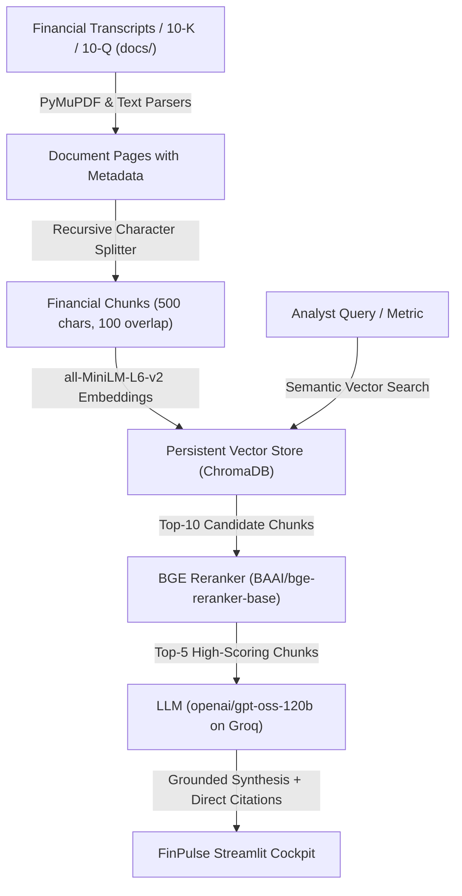

# 📈 FinPulse: AI Financial & Earnings Call Research Copilot

[](https://share.streamlit.io)
[](https://www.python.org/)
[](https://groq.com/)
[](https://www.trychroma.com/)
[](https://opensource.org/licenses/MIT)

An institutional-grade **Retrieval-Augmented Generation (RAG)** copilot designed to analyze corporate earnings call transcripts, SEC 10-K/10-Q filings, and financial metrics.

FinPulse delivers strict numerical grounding, verifiable source citations, cross-company guidance inconsistency detection, and zero-hallucination guardrails across top global technology and enterprise leaders.

---

## 🌟 Key Capabilities

- **🔍 Financial Q&A Copilot**:
  - Natural-language queries over complex corporate transcripts and earnings reports.
  - Interactive prompt chips for instant benchmarking (e.g., Blackwell GPU margins, Azure vs. Google Cloud operating profit, Tesla Robotaxi CapEx).
  - Every answer includes exact document-level citations with verbatim source snippets.
  - Colored confidence badges (High / Medium / Low) based on evidence density and semantic similarity.

- **⚖️ Cross-Company Guidance & Peer Inconsistency Detection**:
  - Compare statements, guidance, and strategic roadmaps between any two companies (e.g., NVIDIA vs. Microsoft on AI Infrastructure CapEx, Tesla vs. Alphabet on Autonomous Mobility).
  - Automatically identifies conflicting forecasts, margin divergences, and differing strategic outlooks with structured reasoning.

- **📁 Financial Filings & Transcripts Library**:
  - Inspect indexed earnings call transcripts with live chunk and file size statistics.
  - Ingest new quarterly reports or SEC filings (`.pdf`, `.txt`, `.md`) dynamically via drag-and-drop.

- **⚡ Isolated Workspace Navigation**:
  - Clean, dedicated sidebar navigation separating Q&A, Peer Comparison, and Filings Library into dedicated, non-overlapping views.

---

## 🏗️ Architecture Pipeline



---

## 🚀 Quick Start (Local Setup)

### 1. Prerequisites
- Python 3.10 or higher
- A free Groq API Key ([console.groq.com/keys](https://console.groq.com/keys))

### 2. Installation
```powershell
# Clone the repository
git clone https://github.com/AdityaJare/FinPulse.git
cd FinPulse

# Create and activate virtual environment
python -m venv venv
.\venv\Scripts\Activate.ps1   # On Windows
source venv/bin/activate       # On Linux/macOS

# Install dependencies
pip install -r requirements.txt
```

### 3. Configure API Key
Create a `.env` file in the root directory:
```env
GROQ_API_KEY=gsk_your_api_key_here
```

### 4. Index Financial Documents
```powershell
python ingest.py --clear
```

### 5. Launch the Application
```powershell
streamlit run app.py
```
Open **[http://localhost:8501](http://localhost:8501)** in your browser.

---

## ☁️ Streamlit Community Cloud Deployment

Deploying FinPulse is free, automatic, and takes less than 2 minutes:

1. **Push your code to GitHub**:
   ```powershell
   git add .
   git commit -m "Deploy FinPulse to Streamlit Cloud"
   git push origin main
   ```

2. **Deploy on Streamlit Community Cloud**:
   - Navigate to [share.streamlit.io](https://share.streamlit.io/) and click **"New app"**.
   - Select your repository: `AdityaJare/FinPulse`
   - Set Branch to `main` and Main file path to `app.py`.

3. **Set Cloud Secrets**:
   - In **Advanced Settings > Secrets**, paste your key:
     ```toml
     GROQ_API_KEY = "gsk_your_groq_api_key_here"
     ```
   - Click **Deploy**!

> **First-Time Cloud Launch**: When deployed on a fresh container, simply click the **"🚀 Initialize Financial Database"** button on the dashboard to build the vector index instantly.

---

## 📁 Repository Structure

```
FinPulse/
├── app.py                     # Streamlit FinPulse UI (Sidebar navigation, Q&A, Peer Comparison)
├── config.py                  # Tunable parameters, model configs, and secrets loader
├── ingest.py                  # Document parser, chunker, and vector store loader
├── rag_engine.py              # Retrieval, cross-encoder reranking, and citation synthesis
├── vector_store.py            # ChromaDB interface (embeddings, collections, similarity search)
├── llm_client.py              # LLM client with retry logic, confidence scoring & citations
├── reranker.py                # BGE cross-encoder reranker
├── requirements.txt           # Minimal, cloud-compatible dependencies
├── .streamlit/
│   └── config.toml            # Headless server & dark theme configuration
└── docs/                      # Active financial reports & earnings call transcripts
    ├── alphabet_google_q4_fy2024_earnings_call.txt
    ├── apple_q1_fy2025_earnings_report.txt
    ├── microsoft_q2_fy2025_earnings_call.txt
    ├── nvidia_q4_fy2025_earnings_call.txt
    └── tesla_q4_fy2024_earnings_call.txt
```

---

## 📄 License

This project is licensed under the [MIT License](LICENSE).
